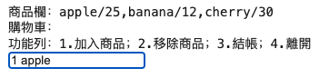

<style>
    :root {
        --color-background: #fff;
        --color-foreground: #333;
        --color-highlight: #69f;
        --color-dimmed: #888;
    }
</style>

<!-- _class: lead -->
<!-- _paginate: false -->
# 程式應用
# Python Overview
許智超
<chihchao@go.edu.tw>

---

<!-- _class: lead -->
## Basic

---

### 註解
- 註解的種類與功能
  - **單行註解**: 使用 `#`
  - **多行註解**: 使用 `'''` 或 `"""`

---

### 資料型態
- **數值型別**
  - int (整數), float (浮點數), bool (布林值), complex (複數)
- **字串型別**
  - 包裹方式：`'...'`、`"..."`、`'''...'''`、`"""..."""`
  - 可透過索引存取字元
- **容器型別**
  - tuple (序對), list (串列), set (集合), dict (字典)

---

### 資料型態操作
- 確認型態：`type()`
- 型態轉換
  - 字串或數字→整數: `int(x)`
  - 字串或整數→浮點數: `float(x)`
  - 物件→字串: `str(x)`

---

### 資料輸出與格式化
- 輸出函數: `print()`
```python
print('Hello', 'world', sep=' ', end='\n')
```
- 特殊字元與脫逸字元
  - 常見脫逸字元 `\'`, `\"`, `\\`, `\n`, `\t` 等

---

### 資料輸入
- 輸入函數: `input([prompt])`
```python
# 問候
name = input('請輸入您的姓名：')
print('您好！', name)
```

---

### EX01-01 加法器
- 由二個輸入取得二個整數，輸出二數相加結果


---

<!-- _class: lead -->
## Expression

---

### 變數
- 變數是一個具有名稱的記憶體儲存位置，用來保存程式中需要操作的資料，並可以隨時更改其內容。
- 為什麼要變數？
  - 變數就像是資料的標籤或是代號，我們可以透過變數間接操作資料。
  - 編輯程式往往會遇到許多「重複」的部分，如果用變數代表這些重複的部分，就能很簡單的進行「一次性」新增、刪除或修改動作。

---

### 識別字
- 識別字
  - 包括變數、函數、類別、模組等名稱。
- 命名規則
  - 不使用運算子、關鍵字或數字開頭。建議駝峰式命名法或底線分隔
- 關鍵字
  - 內建功能或特定用途的詞，可用 `import keyword` 查詢。
```python
import keyword
print(keyword.kwlist)
```

---

### 運算式與運算子
- 運算式
  - 由運算元和運算子組成，計算或判斷式的基礎。


---

### 運算子種類
- 算術運算子
  - 加 (`+`)、減 (`-`)、乘 (`*`)、除 (`/`)、整數除法 (`//`)、取餘數 (`%`)。
- 關係運算子
  - 等於 (`==`)、不等於 (`!=`)、大於 (`>`)、小於 (`<`)等。
- 邏輯運算子
  - 且 (`and`)、或 (`or`)、非 (`not`)。
- 特殊運算子
  - 身分運算子 (`is`, `is not`)。
  - 成員運算子 (`in`, `not in`)。

---

### 字串操作
- 字串的算術運算子
  - 加號 (`+`) 用於字串連接。
  - 乘號 (`*`) 用於字串重複。

---

### 運算子的優先順序
- **優先級排序**
  - 由括號 (`()`) 優先，其次為指數 (`**`)、算術運算子 (`*`, `/`, `%`) 等。

---

#### EX01-02 BMI 計算
- 身體質量指數（BMI）的定義如下：

$$
BMI = \frac{\text{weight（kg）}}{\text{hight（m）}^2}
$$

- 由輸入分別取得體重（kg）及身高（cm），輸出 BMI 值並四捨五入到小數點以下一位。

---

<!-- _class: lead -->
## Control Flow

---

### 流程控制
- 基本概念
  - 程式碼預設由上到下執行。
  - 特殊情形包含條件、迴圈、函數、例外。

---

### 流程控制的主要類型
- 條件
  - 單向條件、雙向條件、多向條件
- 迴圈
  - `for` 迴圈、`while` 迴圈、巢狀迴圈
  - 特殊控制語法：`break`, `continue`
- 函數
  - 為完成特定功能的程式碼，可重複呼叫。
- 例外
  - 處理程式執行錯誤，例如資料型態錯誤。

---

### 條件判斷 - 單向條件
- 語法：`if 判斷式:`
```python
# 高鐵兒童免費
cost = 1490
age = int(input('年紀:'))
if age <= 6:
    cost = 0
print('車票費用', cost)
```
- 注意縮排，建議4個空白。

---

### 條件判斷 - 雙向條件
- 語法：`if 判斷式: ... else:`

```python
# 輸入分數後，判斷分數是否及格。
score = int(input('分數：'))
if score < 60:
    print('不及格')
else:
    print('及格')
```

---

### 條件判斷 - 多向條件
  - 語法：`if 判斷式1: ... elif 判斷式2: ... else:`
```python
# 輸入分數判斷分數等級
score = int(input('分數：'))
if score < 60:
    print('D')
elif score < 70:
    print('C')
elif score < 80:
    print('B')
else:
    print('A')
```


---

### EX01-03 Rock-Paper-Scissors
- 寫一支和電腦玩剪刀石頭布的遊戲
- 使用 0 代表石頭， 2 代表剪刀， 5 代表布
- 使用 random.choice ([0, 2, 5]) 隨機挑選一數字代表電腦出拳
- 使用 input() 由玩家輸入 0 、 2 、 5 代表玩家出拳
- 輸出：
  - Draw 平手
  - You win 玩家贏
  - You lost 玩家輸

---

### 迴圈結構 - for 迴圈
- 處理有次序且已知次數的問題。
- 可搭配 `range()` 或有序容器（tuple, list）使用。
```python
# 等差級數和
sum = 0
for i in range(101):
    sum += i
print(sum)
```

---

### 迴圈結構 - while 迴圈
- 處理無法預知次數的問題。
- 需避免無窮迴圈。
```python
# 輸入正確的密碼才能通過
password = 'Life finds a way.'
while input('Password:') != password:
    print('Password incorrect!')
print('Pass')
```

---

### 迴圈結構 - 特殊控制
- **`break`**
  - 強制結束迴圈。
- **`continue`**
  - 跳過當前迴圈的後續程式碼，直接進入下一次迴圈。

---

### 例外處理
- 語法：`try:...except:`
  - 預防程式錯誤中斷執行。
```python
# 取餘數
try:
    n = int(input())
    m = int(input())
    r = n % m
except:
    print("Something wrong!")
else:
    print(r)
finally:
    print("Bye!")
```

---

### EX01-04 終極密碼
- 程式自動產生一個1~99的亂數
- 程式顯示猜測範圍，並讓玩家輸入猜測的數字
- 如果輸入的數字超出範圍要顯示超出範圍
- 如果沒猜中，顯示新的範圍並讓玩家一直猜到猜中數字為止

---

<!-- _class: lead -->
## String

---

### 字串格式化
- 格式化是指以指定的格式輸出資料。
- 常見用法：`% ()` 、 `str.format()`與`f'string'`。

---

### `% ()` 格式
- 支援多種格式：`%s`、`%d`、`%f`、`%e` 等。
- 修飾子可調整對齊、寬度、填充。
```python
print("Hello, %s. %d" % ("World", 520))
```

---

### `str.format()` 格式
- 透過 `{}` 包含變數。
```python
name = "Alice"
age = 25
print("My name is {} and I am {} years old.".format(name, age))
```

---

### `f'string'` 格式
- 在字串前加上「f」即可進行格式化，並將變數名稱放入「{}」之中。
- 指定輸出格式時，和 format() 相同，使用「:」來區格。
```python
x = 9
y = 9
print(f'{x:02} * {y:02} = {x*y}')
```

---

### 字串切片
- 使用索引 `str[start:end:step]` 提取部分字串。
- 索引可以負值
```python
text = "abcdefghij"
print(text[2:8:2])
print(text[::-1]) 
```

---

### 常用的字串方法 `split()`
- 用於將字串依據指定的分隔符號切割成子字串，並將結果以列表的形式返回。
```python
text = "apple,banana,cherry"
result = text.split(",")
print(result)
```

---

### 常用的字串方法 `replace()`
- 用於將字串中的某些子字串替換為新的子字串，並返回一個新字串。
```python
text = "apple banana apple cherry"
result = text.replace("apple", "grape")
print(result)
```


---

### EX01-05 Caesar Cipher: Encode and decode
- 請寫一個凱撒密碼加密解密器
- 第一個輸入加解密及金鑰，例：`d7`，`d`表示解密（`e`表示加密），數字 `7`表金鑰
- 第二個輸入表示想要加解密的文字
- 輸出加密後或解密後的文字

---

<!-- _class: lead -->
## Container

---

### 容器型別比較
<br />


---

### Tuple (序對)
- 使用 `()` 宣告，內容不可更改，有順序。
- 常用方法：`index(val)`、`count(val)`。

```python
# 建立一個元組
fruits = ('apple', 'banana', 'cherry', 'apple', 'banana', 'apple')
banana_index = fruits.index('banana')
print("第一個 'banana' 的索引位置:", banana_index)
apple_count = fruits.count('apple')
print("'apple' 出現的次數:", apple_count)
```

---

### List (串列)
- 使用 `[]` 宣告，可修改內容，有順序。
- 新增、刪除：`append(obj)`、`remove(val)`
```python
my_list = []
my_list.append('apple')
print(my_list)
my_list.append('banana')
print(my_list)
my_list.remove('banana')
print(my_list)
```

---
### 串列 `sort()`
```python
words = ['banana', 'apple', 'cherry', 'date']
# 將字串列表進行字母升序排序
words.sort()
print("字母升序排序後的列表:", words)
# 根據字串長度進行降序排序
words.sort(key=len, reverse=True)
print("根據字串長度降序排序後的列表:", words)
```

---

### 串列 `map()`
- 將函數應用於可迭代對象：
```python
numbs = map(int, input().split())
```

---

### 串列 `join()`
- 合併序列為字串：
```python
", ".join(["Apple", "Banana", "Cherry"])
```

---

### 串列 `enumerate()`
- 同時獲取索引和值：
```python
for i, val in enumerate(["Spring", "Summer"], 1):
    print(i, val)
```

---

### 列表生成式
- 範例：
```python
# 使用列表生成式創建平方數列表
[x * x for x in range(1, 11)]
```
- 篩選條件：
```python
# 只保留偶數
[i for i in range(1, 11) if i % 2 == 0]
```

---

### Dict（字典）
- 使用 `{}` 宣告，包含 `key:value` 對應。
```python
# 建立字典
student_scores = {"Alice": 85, "Bob": 90, "Charlie": 78}
# 訪問字典中的值
print("Alice 的分數:", student_scores["Alice"])
# 新增或更新字典中的項目
student_scores["David"] = 88  # 新增
student_scores["Alice"] = 92  # 更新
print("更新後的字典:", student_scores)
# 刪除字典中的項目
del student_scores["Charlie"]
print("刪除後的字典:", student_scores)
```

---

### 字典 - 安全查找
- 如果使用不存在的鍵找值，會出現 `KeyError`。為了避免這種情形，可用 `get()` 方法。
```python
# 使用 get 方法安全地查找值
score = student_scores.get("Eve", "未找到該學生")
print("Eve 的分數:", score)
# 檢查某個鍵是否存在於字典中
is_bob_in_dict = "Bob" in student_scores
print("Bob 是否在字典中:", is_bob_in_dict)
```

---

### 字典 - 字典的鍵與值
- 如果想取得字典中所有鍵、值或項目，可使用 `keys()`、`values()`或`items()`。
```python
# 獲取所有鍵
keys = student_scores.keys()
print("字典中的鍵:", list(keys))
# 獲取所有值
values = student_scores.values()
print("字典中的值:", list(values))
# 獲取所有鍵值對
items = student_scores.items()
print("字典中的鍵值對:", list(items))
```

---

### 字典 - 遍歷字典

```python
# 遍歷鍵值對
for name, score in student_scores.items():
    print(f"{name} 的分數是 {score}")
# 遍歷鍵
for name in student_scores.keys():
    print("學生姓名:", name)
# 遍歷值
for score in student_scores.values():
    print("分數:", score)
```

---

### Set（集合）
- 使用 `{}` 宣告，無順序且不重複。
- 集合裡所有的資料都不會重複，所以常用來進行去除重複的資料、或判斷元素間是否有交集、聯集或差集之類的關聯性。

---

### 集合 - 基本操作
```python
# 建立集合
my_set = {1, 2, 3, 4, 5}
# 添加元素
my_set.add(6)
print("添加 6 後的集合:", my_set)
# 移除元素
my_set.remove(3)  # 如果元素不存在，會引發 KeyError
print("移除 3 後的集合:", my_set)
my_set.discard(10)  # 使用 discard 方法移除元素（不存在也不會報錯）
print("嘗試移除不存在的元素後的集合:", my_set)
# 清空集合
my_set.clear()
print("清空後的集合:", my_set)
```

---

### 集合 - 運算
- 交集 `&`、聯集 `|`、差集 `-`。
<br />


---

### 集合 - 運算
```python
# 集合的基本運算
set_a = {1, 2, 3, 4}
set_b = {3, 4, 5, 6}
# 聯集（Union）
union_set = set_a | set_b  # 或使用 set_a.union(set_b)
print("聯集:", union_set)
# 交集（Intersection）
intersection_set = set_a & set_b  # 或使用 set_a.intersection(set_b)
print("交集:", intersection_set)
# 差集（Difference）
difference_set = set_a - set_b  # 或使用 set_a.difference(set_b)
print("差集:", difference_set)
```

---

### 容器通用函數
- `max(container)`
- `min(container)`
- `sum(container)`
- `len(container)`

---

### EX01-06 簡易購物車
- 請參考以下程式碼，實作一個簡易的購物車，能夠加入商品、移除商品、；結帳計算金額
```python
from IPython.display import clear_output
shopping_cart = []
products = { "apple": 25, "banana": 12, "cherry": 30 }
while True:
    clear_output()
    # write your code here
```
<br />


---

<!-- _class: lead -->
## Function

---

### 函式的基本概念
- 定義：包含多行程式碼的一行程式，代表特定功能。
- 優點：
  - 提高程式的重複使用率，避免重複撰寫。
  - 增強程式架構清晰度，便於維護。
- 分類：
  - 內建函式（如 `print()`、`input()`）。
  - 自訂函式（根據需求設計）。

---

### 內建函式
- 可直接使用。
- 查看內建函式的方法：
  ```python
  dir(__builtins__)
  ```
- 官方文件參考：[Python 內建函式](https://docs.python.org/3/library/functions.html)

---

### 自訂函式
- 使用 `def` 關鍵字：
```python
# 定義一個函式，計算兩個數字的和
def add_numbers(a, b):
    s = a + b
    return s
# 呼叫函式並接收回傳值
result = add_numbers(5, 3)
print(f"The sum is: {result}")
```

---

### 預設參數
- 預設參數：參數可提供預設值。
```python
def show_data(name='Anonymous'):
    print(name)
show_data()
```

---

### 回傳值
- 函式可回傳多個值：
```python
def example():
    return 1, 2, 3
a,b,c = example()
```

---

### 區域變數與全域變數
- 區域變數：僅限於函式內使用。
- 全域變數：可被多個函式共用。
- 當函式的參數是可變容器（例如 list、dict 或 set）時，對該容器的修改會影響全域範圍內的容器，因為 Python 的參數傳遞是通過引用（reference）進行的，而不是通過值進行的。

---

### Lambda 函式
- 匿名函式 `lambda 參數: 表達式`，無需名稱，適用於簡單操作。
```python
# 使用 lambda 計算兩數的加總
add = lambda a, b: a + b
print(add(3, 5))  # 輸出: 8
```
- 搭配其他函式 `map()`、`filter()`、`sorted()` 使用。
```python
# 使用 map 與 lambda 計算平方
numbers = [1, 2, 3, 4, 5]
squared_numbers = list(map(lambda x: x**2, numbers))
print("平方數列表:", squared_numbers)  # 輸出: [1, 4, 9, 16, 25]
```

---

### Gradio 模組

- 快速構建和共享應用程式的 Python 工具包。讓開發者能夠輕鬆地為模型或函數建立互動式介面，並能在本地或雲端上快速部署和共享。
```python
import gradio as gr
def greet(name):
    return f"Hello, {name}!"
# 建立介面
interface = gr.Interface(
    fn=greet,  # 要建立介面的函數
    inputs="textbox",  # 輸入類型
    outputs="textbox"  # 輸出類型
)
# 啟動介面
interface.launch()
```

---

### EX01-07 美食資訊查詢
- 參考以下資料，並使用 Gradio 模組，製作一個美食資訊查詢 APP

```python
!pip install gradio
```
```python
import gradio as gr
food_database = [
    {"name": "春蘭割包", "address": "800高雄市新興區復興一路5號", "phone": "+88672017806"},
    {"name": "上海生煎湯包", "address": "807高雄市三民區熱河一街208號", "phone": "+88673220702"},
    {"name": "岡山舊市羊肉", "address": "820高雄市岡山區河華路111號", "phone": "+88676258151"},
    {"name": "黃家肉燥飯", "address": "825高雄市橋頭區橋南路106號", "phone": "+88676123253"},
    {"name": "龍記餡餅", "address": "820高雄市岡山區溪東路2號", "phone": ""}
]
```

---

<!-- _class: lead -->
## File

---

### 檔案格式

- 文字檔 (Text File)
  - 文字檔是由純文字構成的檔案，使用人類可讀的字元編碼（如 ASCII、UTF-8 等）儲存資料。常見檔案格式有 `.txt` `.csv` `.json` `.html` 等檔案格式。
  - 可以使用文字編輯器（如 Notepad、VS Code 等）查看和修改。
- 二進位檔 (Binary File)
  - 二進位檔直接使用二進位數據（0 和 1）儲存資料，適合儲存非文字型資料。常見類型有 `.jpg` `.mp3` `.mp4` `.exe` 等。
  - 特定結構或編碼方式，僅能由特定軟體或程式正確解讀。

---

### 文字檔和二進位檔差異比較

|特性|文字檔|二進位檔|
|-|-|-|
|儲存內容|純文字|任意數據（包括壓縮或編碼）|
|可讀性|人類可讀|僅機器或特定應用程式可讀|
|編輯工具|文字編輯器|特定軟體|
|用途範例|設定檔、程式碼、簡單數據|圖片、影片、執行檔、壓縮檔|
|檔案格式|`.txt` `.csv` `.json` `.html`|`.jpg` `.mp3` `.mp4` `.exe`|

---

### Colab 虛擬機檔案空間
- 初始位置為 `/content`。
- 檔案只存在執行階段期間，結束後檔案會消失。
- 可上傳檔案並連結 Google 雲端硬碟。

---

### 檔案讀取
- 使用 `open()` 函數：
  ```python
  file_object = open(file_name, 'r', encoding='UTF-8')
  ```
- `file_name`：檔案名稱與路徑。
- `access_mode`：檔案存取模式。
- 使用 `file_object.close()` 關閉檔案。

---

### 檔案存取模式

|模式|描述|
|-|-|
|r|讀取模式（檔案必須存在）|
|w|寫入模式（檔案不存在則新建，存在則覆蓋）|
|a|追加模式（檔案不存在則新建）|
|rb|讀取二進位檔案|
|wb|寫入二進位檔案|

---

### 範例
```python
f = open('example.txt', 'r')
data = f.read()
f.close() # 記得關閉檔案
```

---

### 檔案開啟與關閉
- 建議使用 `with open()` 確保檔案自動關閉：
  ```python
  with open('example.txt', 'r') as f:
      data = f.read()
  ```

---

### 檔案讀取方式
- 常用方法：
  - `file_object.read()`：一次讀取整份文件。
  - `file_object.readline()`：一次讀取一行。
  - `file_object.readlines()`：讀取所有行並返回列表。
- 利用 `str.strip()` 移除行首與行尾的空白或換行符號。

---
### 檔案讀取範例
```python
with open("example.txt", "r") as file:
    content = file.read()
    print(content)  # 輸出: 檔案的完整內容
```
```python
with open("example.txt", "r") as file:
    lines = file.readlines()
    print(lines)  # 輸出為列表，每一行作為列表中的一個元素

```

---

### 檔案寫入方式
- 常用方法：
  - `file_object.write(string)`：將字串寫入檔案。
  - `file_object.writelines(list)`：將列表內容依序寫入檔案。
- 注意：不會自動在字串結尾添加換行符號。

---

### 範例

```python
with open("output.txt", "w") as file:
    file.write("This is the first line.\n")
    file.write("This is the second line.\n")
print("檔案已寫入！")
```

```python
lines = ["Line 1\n", "Line 2\n", "Line 3\n"]
with open("output.txt", "w") as file:
    file.writelines(lines)
print("多行已寫入到檔案！")
```

---

<!-- _class: lead -->
## Module

---

### Module

- 模組其實就是寫好程式碼的.py檔，裡面可能定義了函式、類別、變數等內容。想要使用時，可以藉由import指令來匯入到目前的程式中使用
- 匯入模組指令：
```python
import random
random.randint(0, 100)
```
```python
from random import randint
randint(0, 100)
```
- 可以用 import module as md 的方式換名稱
