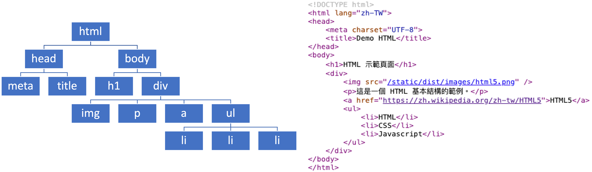
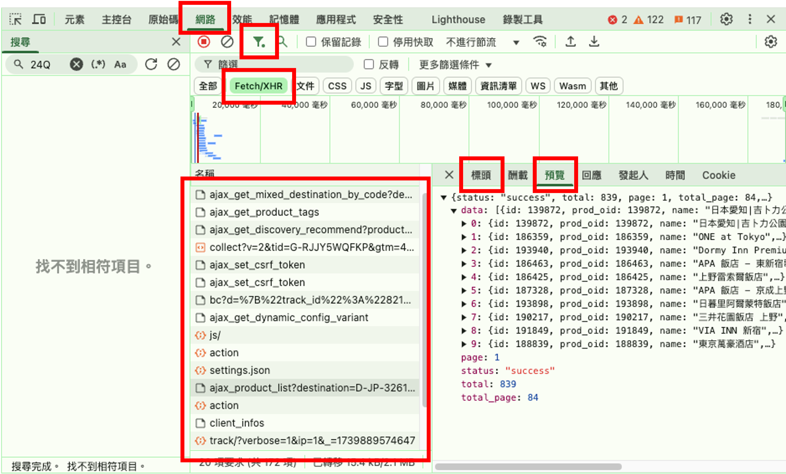

<style>
    :root {
        --color-background: #fff;
        --color-foreground: #333;
        --color-highlight: #69f;
        --color-dimmed: #888;
    }
</style>

<!-- _class: lead -->
<!-- _paginate: false -->
# 程式應用
# Web Crawler
許智超
<chihchao@go.edu.tw>

---

<!-- _class: lead -->
## API

---

### API

- API（Application Programming Interface，應用程式介面） 是一組定義和規範，允許不同的應用程式或服務之間進行溝通與互動的方式。它提供了一組功能或工具，讓開發人員可以使用特定系統或程式的功能，而無需了解其內部實作細節。


---

### API 的類型

- 庫（Library）或框架的 API
    - 程式語言的庫或框架提供的功能接口，例如 Python 的 Pandas、JavaScript 的 React。
- 基於網路的 API（Web API）
    - HTTP 協定：多數 API 是基於 HTTP 協定，使用標準的 GET、POST、PUT、DELETE 等方法來進行操作。
    - JSON 或 XML 格式：API 的回應通常是 JSON 或 XML 格式的資料。
- 作業系統 API, 硬體 API

---

### Gemini API

- 申請金鑰：[Google AI Studio](https://aistudio.google.com/app/apikey)
- 介接 Gemini API 取得回應
```python
import google.generativeai as genai

genai.configure(api_key="YOUR_API_KEY")
model = genai.GenerativeModel("gemini-2.0-flash-exp")
response = model.generate_content("Explain how AI works")
print(response.text)
```

---

### Gemini API

- 將金鑰導入 Colab 的環境變數
```python
from google.colab import userdata
import google.generativeai as genai
genai.configure(api_key=userdata.get('GOOGLE_API_KEY'))
```

---

### EX02-01 My Chatbot
- 連結 Gemini API，製作一支專屬自己的聊天機器人
    ```python
    # 使用連續對話
    chat = model.start_chat(history=[])
    response = chat.send_message('Who are you?')
    ```
- 顯示 Markdown 語法
    ```python
    from IPython.display import Markdown, display
    display(Markdown(response.text))
    ```

---

<!-- _class: lead -->
## Web Crawler

---

### 什麼是網路爬蟲（Web Crawler, Web Scraping）？

- 網路爬蟲（Web Crawler）是一種從網站自動擷取資料的技術，通常由程式或自動化機器人執行。它的主要目的是從網頁抓取 HTML、JSON、XML 或其他格式的數據，然後進行分析或儲存。
- 網路爬蟲的應用
    - 數據分析：從新聞網站擷取最新資訊，進行趨勢分析。
    - 電商比價：爬取不同網站上的產品價格，進行比較。
    - 投資與金融：監控股市數據、外匯走勢，進行財務分析。


---

### 網路爬蟲（crawler）運作流程
- 全球互聯網運行架構
<br />


---

### Request

- URL：URL（Uniform Resource Locator，統一資源定位器）是用來標示互聯網上資源的地址或路徑。通俗地說，URL 就是我們在瀏覽器地址欄中輸入的網址，讓我們可以訪問網站或其他網絡資源。
```
https://www.example.com/articles/page1.html?id=123&name=abc#section1
```
- `Protocol` `Domain Name` `Path` `Query Parameters` `Fragment`

---

### GET 和 POST 的主要差異

| 特性| GET | POST |
|-|-|-|
| 資料位置 | 資料附在 URL 後面，以 ? 開始，用 & 分隔多個參數 | 資料包含在請求的主體（body）中 |
| 是否可見 | 資料可以直接在瀏覽器地址欄看到，容易被記錄或分享 | 資料在主體中傳送，對外是隱藏的 |
| 大小限制 | URL 長度通常有限制（依伺服器和瀏覽器，約 2,000 個字元） | 較少限制，可以傳送較大的資料，例如 JSON 資料、圖片、或檔案 |

---

### Response

- Status Code: 2xx（成功）, 3xx（重定向）, 4xx（客戶端錯誤）, 5xx（伺服器錯誤）
- Headers: Content-Type, Content-Length, Set-Cookie
- Body: HTML, JSON, XML, 純文字或檔案

---

### Requests 模組

- 在 Python 進行 Request： requests 是 Python 中最流行的 HTTP 請求庫之一，用於向網頁或 API 發送 HTTP 請求並獲取伺服器的回應。

```python
import requests
# 發送 GET 請求
response = requests.get("https://api.github.com")
print(response.status_code)  # 檢查回應狀態碼，例如 200 表示成功
```
- 如果亂碼加上 `response.encoding = 'utf-8'`
- 請求資料為文字時，可用 `response.text` 取得值
- 請求資料為二進位檔時，可用 `response.content` 取得值
- 請求資料為 JSON 格式，`response.json()` 取得字典資料

---

### 下載圖檔

```python
# 圖片下載
# https://youtu.be/ZvqnkRd1iyw
# https://img.youtube.com/vi/ZvqnkRd1iyw/sddefault.jpg
import requests
url = 'https://img.youtube.com/vi/qo3H-VgXmHE/sddefault.jpg'
r = requests.get(url)
with open('ng.jpg', 'wb') as f:
    f.write(r.content)
```

```python
# 用 wget 指令
!wget -O 檔名 網址
```

---

### JSON

- JSON（JavaScript Object Notation）是一種輕量級的資料交換格式，設計簡單易讀，且易於機器解析與生成。
- JSON 的特點：
    - 易於識讀：結構直觀，類似於 JavaScript 的物件語法，適合人類閱讀和理解。
    - 語言獨立：純文本格式，容易在不同的程式語言之間交換資料。
    - 輕量簡單：JSON 格式簡單，比 XML 更精簡，因此傳輸和處理的效率更高。
    - 易於解析：多數程式語言都內建 JSON 解析工具，使得開發工作變得簡單。

---

### JSON 基本結構

```JavaScript
{
    "name": "John Doe",
    "age": 30,
    "isStudent": false,
    "skills": ["Python", "JavaScript", "HTML"],
    "address": {
        "street": "123 Main St",
        "city": "New York",
        "zip": "10001"
    }
}
```

---

### JSON Online Parse

- [Json Parser Online](http://json.parser.online.fr/)
- [JSON Editor Online](https://jsoneditoronline.org/)

---

### JSON 的資料類型

|資料類型|範例|說明|
|-|-|-|
|字串|`"Hello"`|文字，使用雙引號包裹|
|數字|`123`, `3.14`|整數與浮點數|
|布林值|`true`, `false`|真或假|
|陣列|`[1, 2, 3]`|有序的值集合|
|物件|`{"key": "value"}`|無序的鍵值對集合|
|空值|`null`|表示空值或無資料|

---

### 在 Python 中處理 JSON - 載入 JSON

- 將 JSON 字串轉換為 Python 字典資料結構。
```python
import json
json_string = '{"name": "Alice", "age": 25, "isStudent": false}'
# 將 JSON 字串轉換為 Python 字典
data = json.loads(json_string)
print(data["name"])  # 輸出: Alice
```

---

### 在 Python 中處理 JSON - 轉為 JSON

- 將 Python 資料結構轉換為 JSON 字串。
```python
import json
data = {
    "name": "Bob",
    "age": 30,
    "isStudent": True
}
# 將資料轉換為 JSON 字串
json_string = json.dumps(data, indent=4)
print(json_string)
```

---

### CSV

- CSV（Comma-Separated Values，逗號分隔值） 是一種用於儲存表格數據的簡單文件格式。以純文字形式存儲數據，使用逗號（,）分隔每列的數據，並以行為單位組織內容。
- CSV 的主要特點
    - 輕量簡單：純文本格式，結構簡單，不包含多餘的標籤。
    - 廣泛支持：多數程式語言（如 Python、R）和數據處理工具（如 Excel、Google Sheets）都可以讀取和寫入 CSV 文件。
    - 通用性：適合小型到中型數據集的儲存與傳輸。
    - 易於識讀：可直接打開並查看，直觀且清晰。

---

### CSV 格式結構

```CSV
Name,Age,City
Alice,25,New York
Bob,30,Los Angeles
Charlie,35,Chicago
```

---

### 在 Python 中處理 CSV - 讀取 CSV

```python
import csv

with open("data.csv", "r") as file:
    reader = csv.reader(file)
    for row in reader:
        print(row)  # 每行是一個列表
```

---

### 在 Python 中處理 CSV - 寫入 CSV

```python
import csv
data = [
    {"Name": "Alice", "Age": 25, "City": "New York"},
    {"Name": "Bob", "Age": 30, "City": "Los Angeles"}
]
with open("output.csv", "w", newline="") as file:
    writer = csv.writer(file)
    writer.writerow(data[0].keys())
    data = [row.values() for row in data]
    writer.writerows(data)
```

---

### EX02-02 高雄紅橘線捷運車站位置查詢

- 資料集：<https://data.gov.tw/dataset/102187>
- OpenStreetMap 開放地圖：<https://www.openstreetmap.org/>
- 為避免不斷重覆存取資料，在 Request 後先將捷運車站位置存成 CSV 文件。後續讀取 CSV 做為資料來源。
- 製作捷運車站選單，選擇後顯示車站資訊及位置地圖
```html
<div style="width: 100%; height: 400px;">
    <iframe
        width="100%"
        height="100%"
        frameborder="0"
        scrolling="no"
        marginheight="0"
        marginwidth="0"
        src="https://www.openstreetmap.org/export/embed.html?bbox={lon-0.01}%2C{lat-0.01}%2C{lon+0.01}%2C{lat+0.01}&layer=mapnik&marker={lat}%2C{lon}">
    </iframe>
</div>
```

---

### XML

- XML（Extensible Markup Language，擴展標記語言） 是一種用於儲存和傳輸結構化資料的標記語言。XML 的設計目的是讓人類和機器都能輕鬆讀取，同時具有極大的靈活性，適合用來描述各種不同型態的資料。
- XML 特點：
    - 結構化：XML 使用標籤和層級結構來組織資料，非常適合表示複雜的資料模型。
    - 可擴展性：XML 沒有固定的標籤，可以根據需要自定義結構。
    - 跨平台：XML 是純文字格式，與不同的平台、語言和系統兼容。
    - 可讀性：XML 使用清晰的標籤結構，對人類和機器都友好。

---

### XML 基本語法結構

```XML
<?xml version="1.0" encoding="UTF-8"?>
<bookstore>
    <book>
        <title lang="en">Harry Potter</title>
        <author>J.K. Rowling</author>
        <price>29.99</price>
    </book>
    <book>
        <title lang="zh">紅樓夢</title>
        <author>曹雪芹</author>
        <price>19.99</price>
    </book>
</bookstore>
```

---

### feedparser 模組

- feedparser 是一個用來解析 RSS 和 Atom 訂閱源（feeds）的 Python 模組，適用於從新聞網站、部落格或其他網頁獲取最新更新的內容。

```python
!pip install feedparser
```
```python
import feedparser
feed_url = "https://tw.news.yahoo.com/rss"
feed_data = feedparser.parse(feed_url)
for entry in feed_data.entries[:5]:
    print(entry.title)
    print(entry.summary)
    print(entry.link)
    print("---")
```

---

### Colab 連線 Google 試算表

- 取得連線授權

```python
# 引入相關模組
from google.colab import auth
import gspread
from google.auth import default
# 進行授權
auth.authenticate_user()
# 使用 default 方法獲取驗證信息
creds, _ = default()
# 使用 creds 變數授權 gspread 模組
gc = gspread.authorize(creds)
```

---

### Colab 寫入 Google 試算表

```python
# 開啟 Google 試算表
url = 'Your URL Here...'
workbook = gc.open_by_url(url)
# workbook = gc.open_by_key('Your Key Here...')
# 獲取工作簿中索引為 0 的工作表，並將其儲存在 sheet 變數中
sheet = workbook.get_worksheet(0)
# 新增一列資料
sheet.append_row(['title','summary','link'])
```

---

### EX02-02 將 Yahoo 新聞儲存至 Google 試算表

- 使用 feedparser 取得 Yahoo 新聞 RSS 的 title, summary, link，並儲存至 Google 試算表
- https://tw.news.yahoo.com/rss

---

### HTML

- HTML（HyperText Markup Language，超文本標記語言）是 網頁的基礎語言，用來定義網頁的結構與內容。它透過「標籤（tags）」來標示出文字、圖片、影片、連結等元素，使瀏覽器能夠正確顯示網頁內容。

- HTML 不是程式語言，而是一種標記語言（Markup Language），通常與 CSS（負責樣式） 和 JavaScript（負責互動） 搭配使用。

---

### HTML 網頁架構

<https://bit.ly/demo_html>
<br />


---

### BeautifulSoup 模組

- BeautifulSoup 是 Python 的一個 HTML 和 XML 解析庫，用於從網頁中提取特定資訊（Web Scraping，網路爬取）。它能讓開發者輕鬆解析 HTML 代碼，並提取標籤內的內容，如標題、段落、圖片、超連結等。

```python
from bs4 import BeautifulSoup
soup = BeautifulSoup(respone.text, 'lxml')
soup.title
```

---

### BeautifulSoup 模組

```python
# find() tag
soup.find('p', id='p2').text
soup.find('li', class_='even').text
# find_all()
soup.find_all('p')[1].text
```
```python
# 取得屬性
soup.find('a').get('href')
soup.find('a')['href']
```

---

### Chrome 開發人員工具

- Chrome 瀏覽器：
    - F12
    - ... > 更多工具 > 開發人員工具

---

### EX02-03 Download Pokemon Image

- 寶可夢圖鑑網址：
https://tw.portal-pokemon.com/play/pokedex/0001

- 下載寶可夢圖檔 0001～0020，放到 /content/pokemon/ 資料夾中

---

### EX02-04 PTT Gossiping

- PTT 八卦版：
https://www.ptt.cc/bbs/Gossiping/index.html
- 爬取 5 頁 PTT 八卦版的文章日期、網址、標題

---

### EX02-05 開眼電影

- 開眼電影近期上映：
http://www.atmovies.com.tw/movie/next/
- 爬取 開眼電影近期上映 的電影名稱及上映日期，同時下載電影縮圖（以電影名稱命名）

---

### AJAX

- AJAX（Asynchronous JavaScript and XML） 是一種用來建立非同步網頁應用的技術，它允許網頁在不重新載入整個頁面（Partial Page Update）的情況下與伺服器交換數據。
<br />


---

### AJAX



---

### EX02-06 KKDay

- <https://www.kkday.com/zh-tw>
- 目標網站
- 爬取資料
- 資料儲存
- 建議或心得

---

### HW02 Web Crawler

- 目標網站
介紹爬取的數據來源與目標。
- 爬取資料
爬蟲方法與遇到的問題。
- 資料儲存
儲存資料成 CSV 或 JSON 檔。
- 建議或心得

